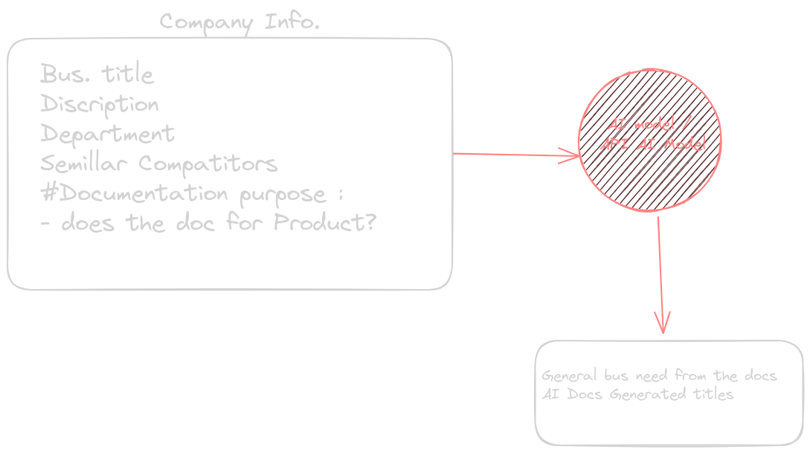
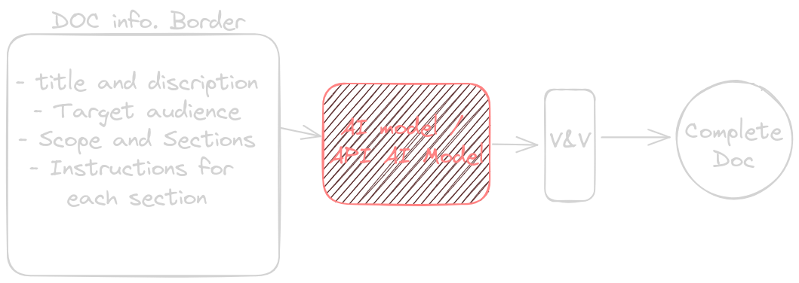

# From Company info. to Needs and Recomendation.
> when we provide the AI model with the company data, The AI model will provide us with the docs needs and titles. (AI DOCS Topics suggestion)




# What is the Type of chatbot that the Help portal needs and why?
- it needs **information retrieval** from (based on) the data and the documents in the help portal website.
- why? to avoid hallucinations and to improve the UX on the boring help portal information representation.
## It takes the information from the documents and does things to it:
- Summarization  
- Explanation (From the Docs)


# Reply Structure

```txt
-------------------
3-5 lines from the summarization of the problem model
-------------------
Breaking down the problem from the docs that the company provided 
...

```

# AI Docs Helper
## Type of data in the docs
- Overall-Bussiness Q : (AI can help to do that) 
- Bussiness-specific Q : (Bussiness must provide the complete version of it )

## Overall Bussiness Q
- Topics (Titles)
- Topic description 
- topic data


## How to create the (Overall Bussiness Q )
- Provide a descriptive title.
- Identify the target audience. (Needs and Level of knowledge)
- scope of the documentation. (sub titles with sections)
- What format should the documentation be in (md fils structure)


# EX:

```md

# Title:
- How to use the new customer relationship management (CRM) software

# Target audience: 
- New users of the CRM software

# Scope:
-  The documentation should cover the basic features of the CRM software, such as how to add and manage contacts, create and manage deals, and track sales progress.

# Sections:

- Introduction
- Adding and managing contacts
- Creating and managing deals
- Tracking sales progress
- Conclusion

# Instructions for each section:

## Introduction:

- Provide a brief overview of the CRM software and its benefits.
- Explain who the target audience is and what they can learn from the documentation.
## Adding and managing contacts:

- Explain how to add and edit contact records.
- Explain how to create and manage contact groups.
- Explain how to import and export contact data.
## Creating and managing deals:

- Explain how to create and edit deal records.
- Explain how to track the progress of deals through the sales pipeline.
- Explain how to generate reports on deals.
## Tracking sales progress:

- Explain how to track sales performance by individual, team, and region.
- Explain how to generate sales reports.
## Conclusion:

- Summarize the key points of the documentation.
- Provide links to additional resources, such as the CRM software's help center and support forum.


```

# How to make sure that the API provided us with the full Doc data ?
-  we can add a special word at the end of the doc (**Tell the AI that the doc should end with this special word at the end**) then we can remove it from the doc after the integration of the final version of the Doc.

## EX
```md
- req: create a doc  that (...) and it must end with this special word at the end of the doc (:$%end0fTHeD0c%$:) 
- app validation : **if** the response dosen't contain this special word (...) response with (Continue) **else** respond with DONE_DOC_IS_FINISH

```


